# F1 Results Tracker

[](https://github.com/finneh4249/t1a3-terminal-application)


## Overview

A terminal application that allows users to view and track Formula 1 race results. It interacts with an SQLIte to store and retrieve data.

### Link to GitHub Repository
[GitHub](https://github.com/finneh4249/T1A3-Terminal-Application)

## Dependencies & Requirements

### Operating System
Any modern operating system that is compatible with Python is able to run this application.
There are different installation steps depending on your operating system.

- Windows
- Linux
- MacOS

### Storage

The application is stored in a SQLite database, the database is modest in size, however, a minimum of 2GB of free storage is recommended for this application.

### Memory (RAM)

If you can run your operating system, you have enough ram to run this application.
That being said, it's recommended that you have at least 2GB of free RAM.

### Internet Connection

The application requires an internet connection to run for the first time, and will not work without it. This is required for the application to install package dependencies

### Dependencies

- Python 3.9
- SQLite 3
- Colorama
- Pyfiglet
- Tabulate

## Features

### Main Menu

- View Standings
- View Results
- Advanced Menu
- Help
- View History
- Exit

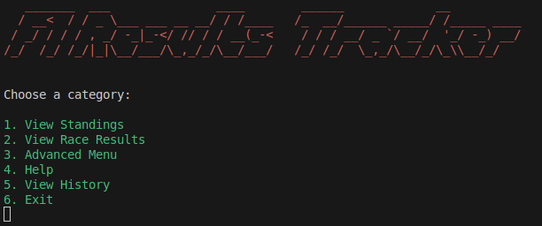

### Driver & Constructor Standings
View the drivers and constructors standing for any year of the Formula 1 Championship.
> NOTE: Constructors Standings are only available for years 1958 - 2024 as there was not a Constructors Championship before that.

#### Arguments

- Driver or Constructor: Whether you want to view "Driver" or "Constructor" results
- Year: The year of the Championship

#### Usage

- To view the driver standings, use the "View Standings" menu option in the main menu and follow the prompts

#### Logic

- The application will ask whether you want to view "Driver" or "Constructor" standings
- The application will ask for the year of the Championship 
- The year is validated as an integer
- The year is validated as a valid championship year (1950 - 2024 for Drivers, 1958 - 2024 for Constructors)
- The standings are accessed from an SQLite database
- The standings are formatted as a table
- The standings are displayed

#### Examples

##### View Driver Standings for 2023
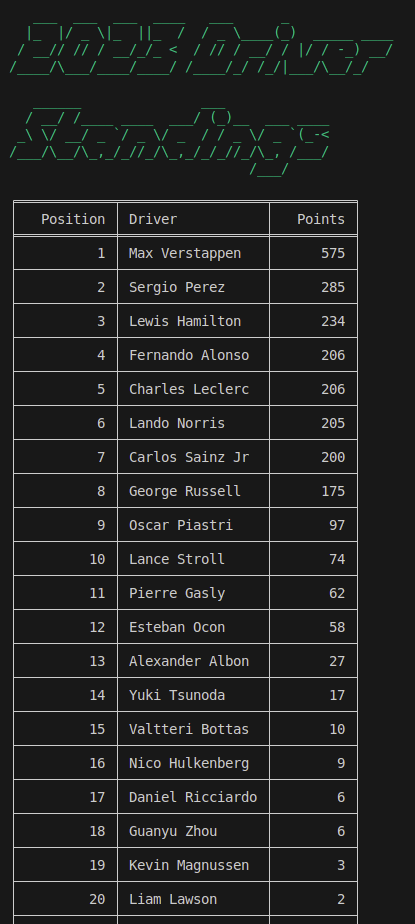
##### View Constructor Standings for 2023
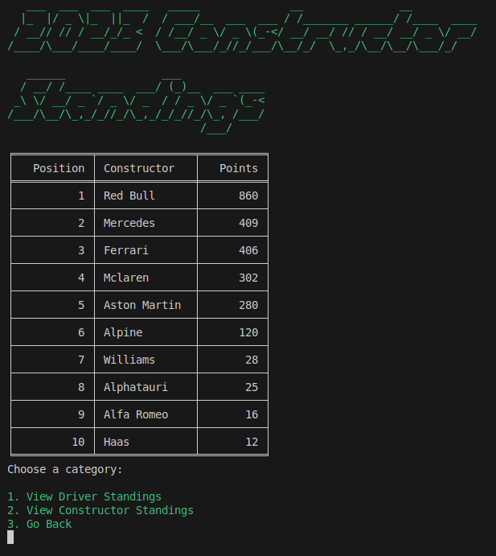


### Race Results
View the race results for any year, and any race of the Formula 1 Championship.

#### Arguments

- Year: The year of the Championship
- Round: The race of the Championship

#### Usage

- To view the race results, use the "View Results" menu option in the main menu and follow the prompts

#### Logic

- The application will ask for the year of the Championship
- The year is validated as an integer
- The year is validated as a valid championship year (1950 - 2024)
- The application will access the SQLite database to retrieve the list of races.
- The application will ask for the race of the Championship
- The race is validated as an integer
- The race is validated as a valid race of the Championship
- The year and race are used to retrieve the race results
- The race results are accessed from an SQLite database
- The race results are formatted as a table
- The race results are displayed

#### Examples

##### View Races for the 2023 Seasons
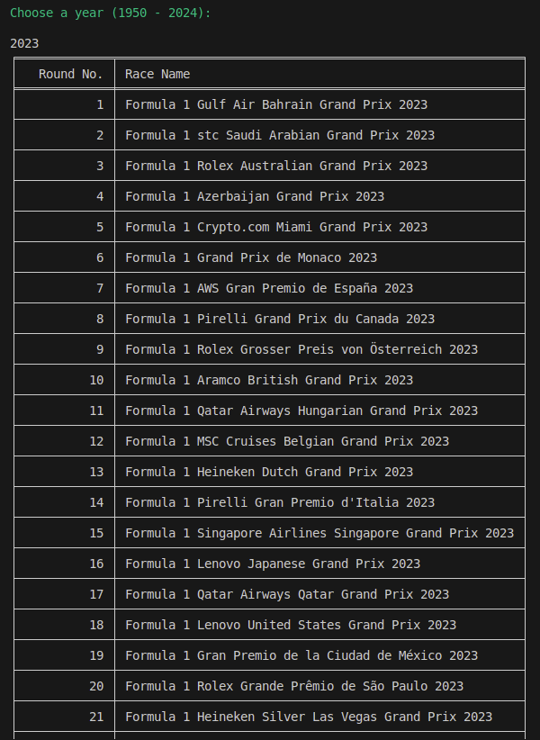

##### View Race Results for Race 15 of 2023
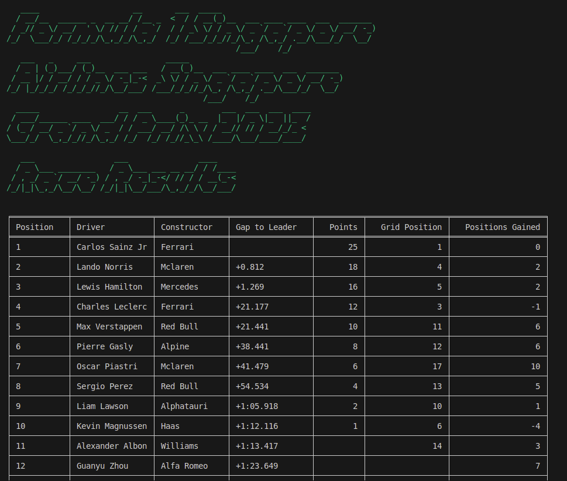

### Standings After Race (Advanced Feature)
View the standings after the race for any year of the Formula 1 Championship.
> NOTE: Constructor Standings After Race is only available for years 1958 - 2024 as there was not a Constructors Championship before that.

#### Arguments

- Driver or Constructor: Whether you want to view "Driver" or "Constructor" results
- Year: The year of the Championship
- Round: The race of the Championship

#### Usage

- To view the standings after a race, use the "Advanced Menu" in the main menu
- Select "View Standings After a Race" and follow the prompts

#### Logic

- The application will ask whether you want to view "Driver" or "Constructor" standings
- The application will ask for the year of the Championship
- The year is validated as an integer
- The year is validated as a valid championship year (1950 - 2024 for Drivers, 1958 - 2024 for Constructors)
- The application will ask for the race of the Championship
- The race is validated as an integer
- The race is validated as a valid race of the Championship
- The year and race are used to retrieve the standings
- The standings are formatted as a table
- The standings are displayed

### Top 10 Results (Advanced Feature)
View the top 10 results for different records.

- Top 10 Pole Positions
- Top 10 Fastest Lap
- Top 10 Championship
- Top 10 Podiums
- Top 10 Points
- Top 10 Wins

#### Arguments

- Driver or Constructor: Whether you want to view "Driver" or "Constructor" results
- Record: The record you want to view

#### Usage

- To view the top 10 results, use the "Advanced Menu" in the main menu
- Select "View Records" and follow the prompts

#### Logic

- The application will ask whether you want to view "Driver" or "Constructor" results
- The application will ask for the record
- The record is validated as a string
- The record is validated as a valid record
- The record is used to retrieve the top 10 results
- The top 10 results are formatted as a table
- The top 10 results are displayed

### Search Results

Each search is stored in an SQLite database, and can be accessed from the main menu by selecting "View History"

#### Arguments

None

#### Usage

- To view the search results, use the "View History" menu option in the main menu

#### Logic

- The search results are accessed from an SQLite database
- The search results are formatted as a table
- The search results are displayed

## Style Guide

This project follows the PEP8 style guide. You can find more information about it [here](https://pep8.org/).


## db_structures.py

This file contains the functions that are used to interact with the SQLite database.

### Functions

#### get_standings_by_year(table,year,type)

This function is used to retrieve the standings for a specific year and table.

#### get_race_id_by_year(year)

This function is used to retrieve the round and official name of races for a specific year.

#### get_race_results(year,round)

This function is used to retrieve the race results for a specific year and round.

#### get_standings_after_race(type, year, round)

This function is used to retrieve the standings after a race for a specific type, year, and round.

#### get_topten_results(type, option)

This function is used to retrieve the top 10 results for a specific type and option.

## Installation

### Linux and MacOS
The first time you run the application you must first install the required dependencies.
To do this you can run the `install.sh` script.

- Ensure that you're inside the `src` directory using `cd src`
- Run the script using
```bash
./install.sh
```

#### Usage

To start the app, simply run the `./run.sh` script in the `src` directory.

#### Arguments

There are also arguments that can be passed to the script to change the behaviour of the application.

- `-h` or `--help` - Display a help message
- `-v` or `--version` - Display the application version
- `-a` or `--advanced` - Display the advanced menu
- `-s` or `--simple` - Display the simple menu

### Windows
The first time you run the application you must first install the required dependencies.
To do this you can run the `install.bat` script.

- Ensure that you're inside the `src` directory using `cd src`
- Run the script using
```bash
./install.bat
```

#### Usage

To start the app, simply run the `./run.bat` script in the `src` directory.

### Troubleshooting Installation

You will not be able to run the script without the required dependencies.

- If you get an error message that the script is not able to install the required dependencies, try running the `install.bat` or `install.sh` script depending on your operating system.

You may get an error message that python, pip, or venv is not installed. If this is the case, you must install these prior to running `install.bat` or `install.sh`.

The hitchikers guide to Python has an extensive resource on how to correctly install Python, Pip, and Venv. You can find the guide [Here](https://docs.python-guide.org/dev/virtualenvs/#make-sure-you-ve-got-python-pip)

## Project Planning

This project utilised Trello to track the progress of the project.

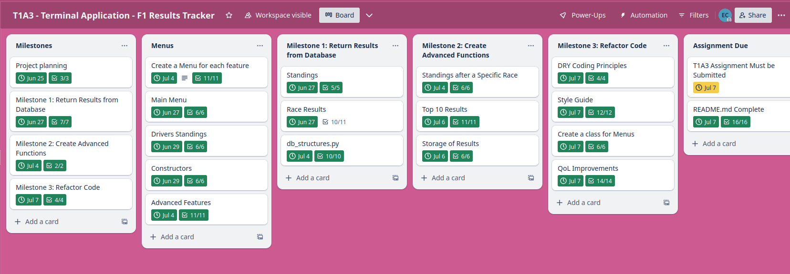

Inside the Trello board, I created Milestones, Tasks, and Subtasks to track the progress of the project.

### Milestones

- Milestone 1: Planning
- Milestone 2: Database Access
- Milestone 3: Advanced Database Functions
- Milestone 4: Refactor

Each milestone was assigned a card in Trello. The cards then had a checklist inside to track the overall progress of the milestone. Each card has a due date.

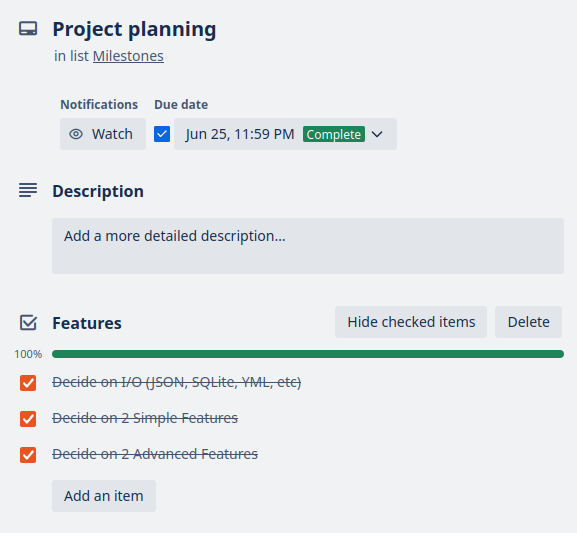
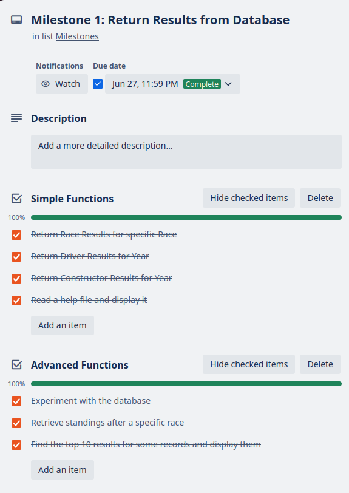
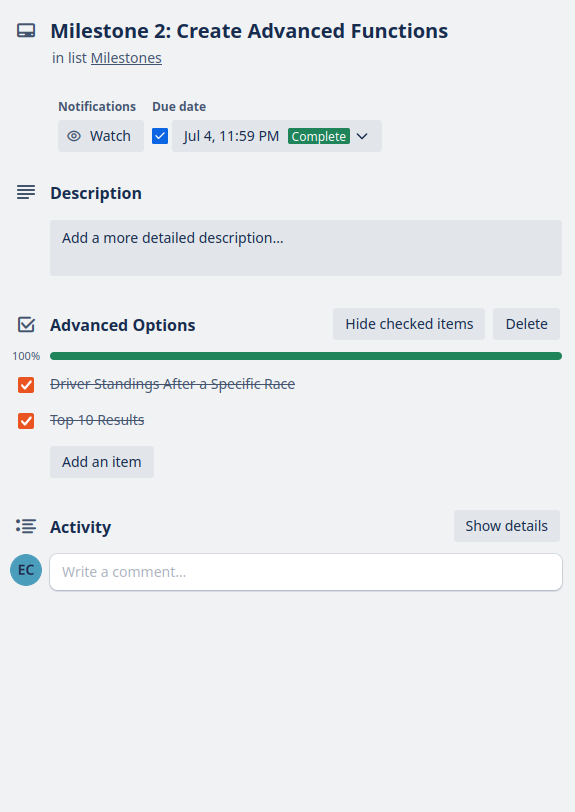


### Menus

- Create a Menu for each feature
- Main Menu
- Driver Standings
- Constructor Standings
- Race Results
- Advanced Features

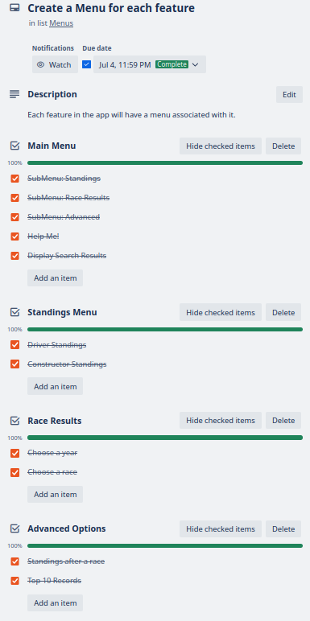
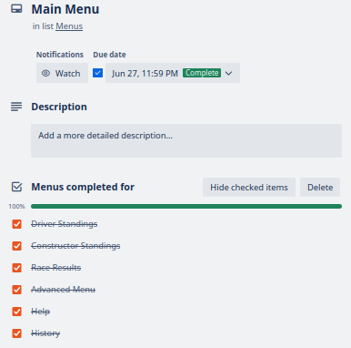
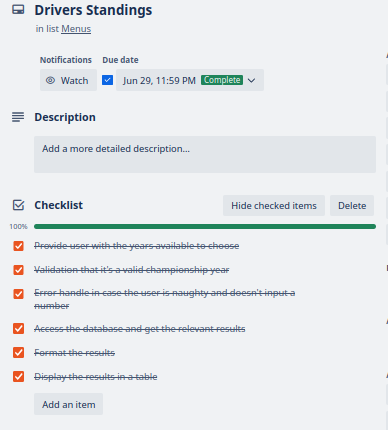
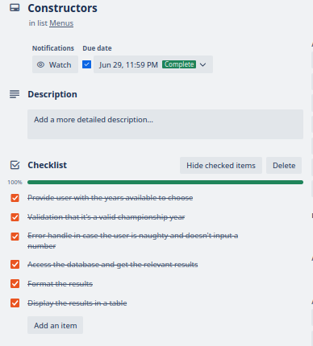
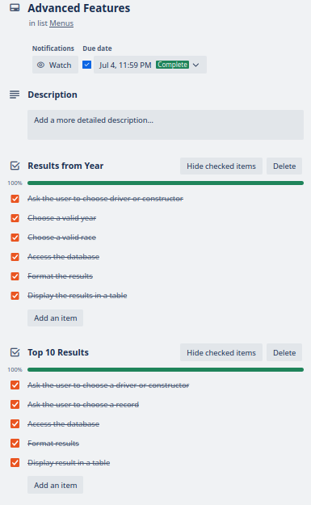

### Milestone 1: Return Results from Database

- Standings
- Race Results
- db_structures.py

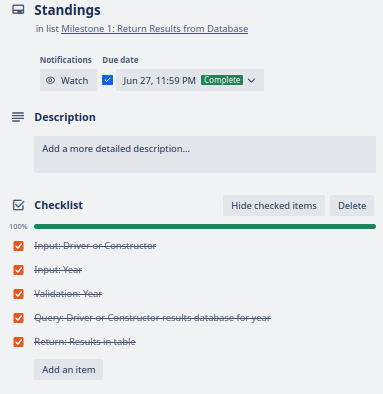
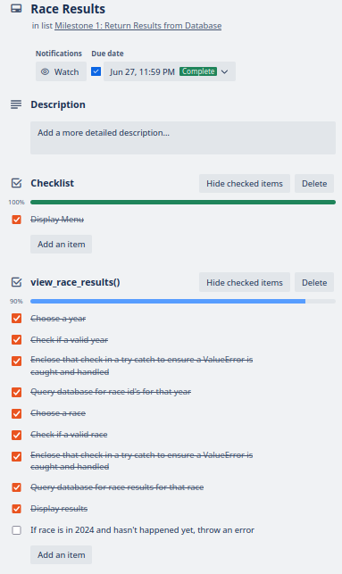
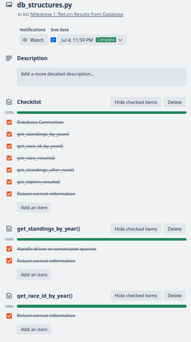

### Milestone 2: Create Advanced Functions

- Standings after a specific Race
- Top 10 Results
- Storage of Results

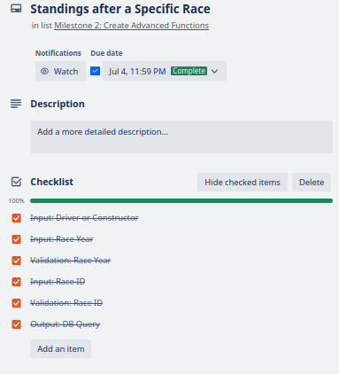
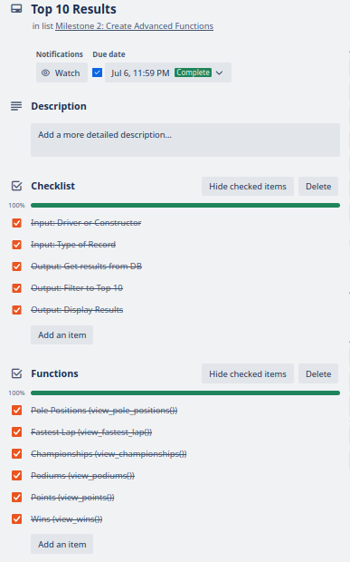
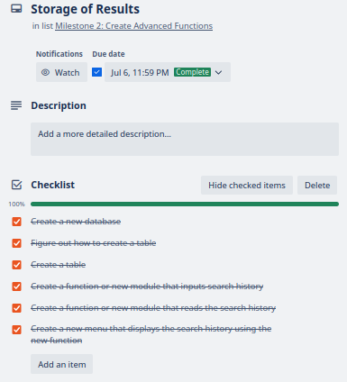

### Milestone 3: Refactor Code

- DRY Coding Principles
- Style Guide
- Create a class for Menus
- QoL Improvements

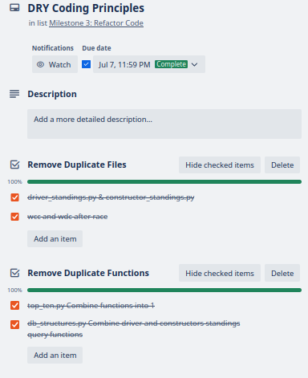
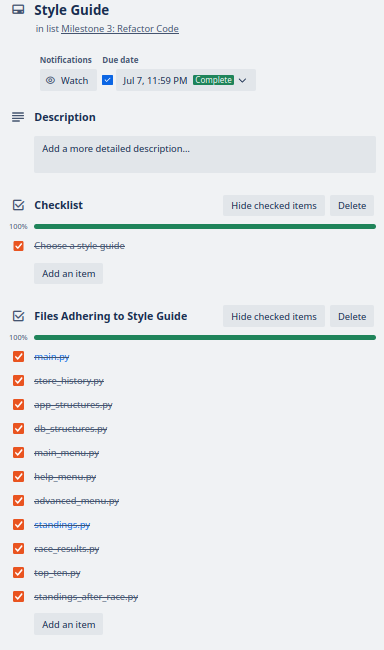
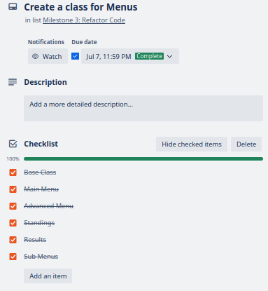
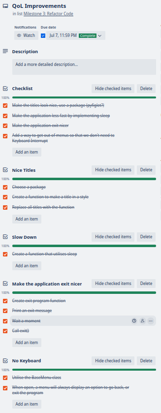

## Credits

This application extensively uses the following projects:

- [F1DB](https://github.com/f1db/f1db) - F1 Driver Database Licensed under [CC BY 4.0](https://creativecommons.org/licenses/by/4.0/)

I am grateful to all the contributors that have made this application possible, without the hard work of the volunteers and contributors of F1DB, I would not have been able to develop this application to the same level of quality.